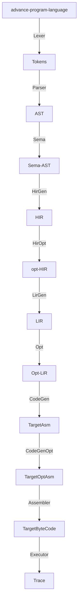

# compilerInZk
Compiler Architecture in ZKVM

# Architecture flow

## advance-program-language

## compiler front-end

### lexer for tokens

### parser for AST

### sema for rich-AST

## compiler middle-end

### hir and generate

### lir and generate

### ir opt

## compiler back-end

### ISA
abstract model of a computer

- data type
- instructions set
- register
- addressing(fundamental)
- storage model
- break and exception(fundamental) 
- input/output model(fundamental)

### backend code generate

- frame lowering
- instruction selection
- slot eliminate
- pro/epi-logue
- inst schdule
- register allocation
- asm print
- ...

## assembler 
- fixup 
- relocation
- encoding

## executor
- link, load and lib
- generate trace